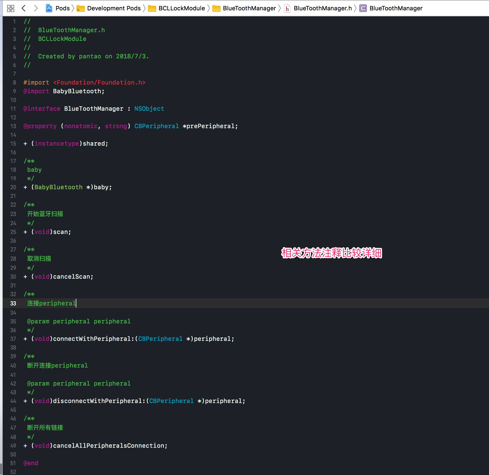
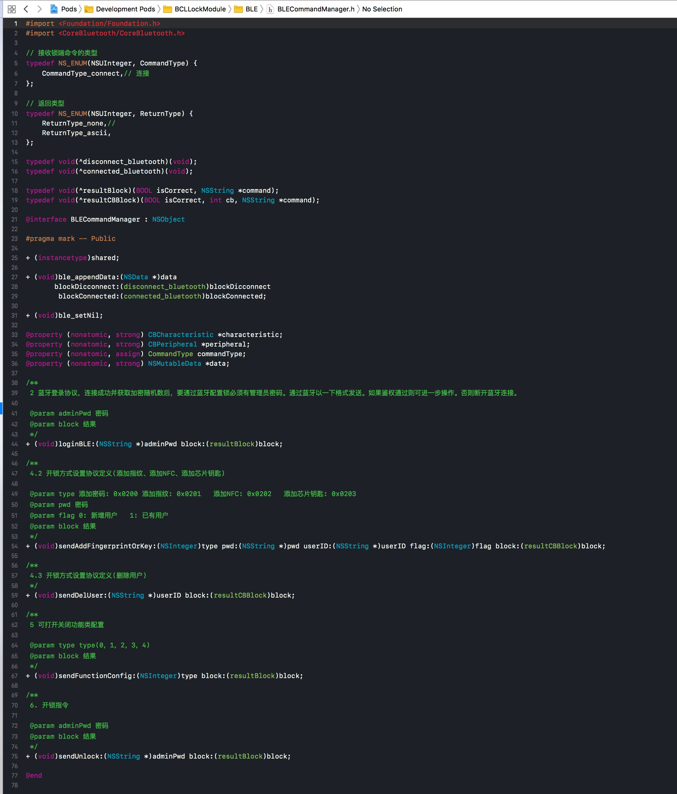

## BabyBluetooth

我们使用的是BabyBluetooth这个开源库(使用block回调可以优雅的开发oc蓝牙相关，而系统的oc蓝牙api使用代理，过于繁琐、耦合)

``` ruby
s.dependency 'BabyBluetooth', '~> 0.7.0'
```

## BCLLock的再封装

* 请详看BLE和BlueToothManager文件夹下的代码

BlueToothManager是个单例类，使用类方法再封装BabyBluetooth相关代码；</br>



BLE文件下核心类是BLECommandManager这个单例类，这个类的工作是封装蓝牙指令。


