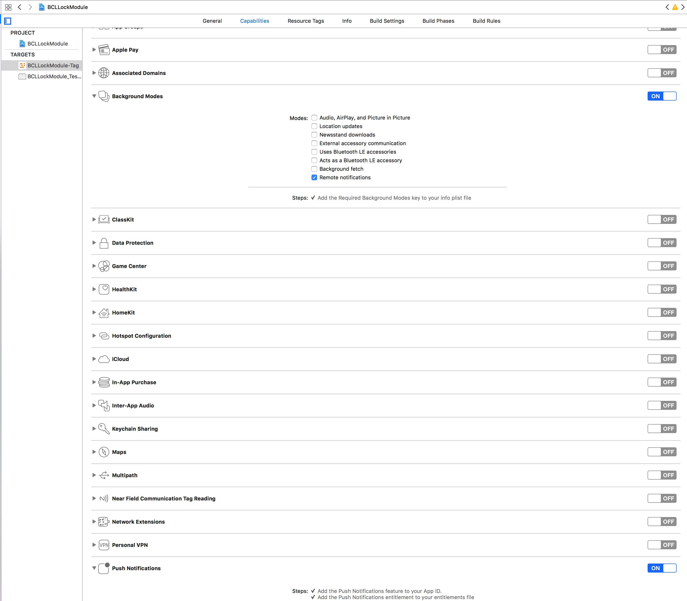

## xcode配置



## 友盟配置

依赖

``` ruby
s.dependency 'UMCPush'
```

引入头文件

``` objective-c
#import <UMPush/UMessage.h>
#import <UMCommon/UMCommon.h>
```

``` objective-c
+ (void)setupUM:(NSDictionary *)launchOptions
{
    // 基本配置
    [UMConfigure initWithAppkey:UAPP_APPKEY channel:@"App Store"];
    //推送
    UMessageRegisterEntity *entity = [[UMessageRegisterEntity alloc] init];
    //type是对推送的几个参数的选择，可以选择一个或者多个。默认是三个全部打开，即：声音，弹窗，角标
    entity.types = UMessageAuthorizationOptionBadge|UMessageAuthorizationOptionAlert | UMessageAuthorizationOptionSound;
    [UMessage registerForRemoteNotificationsWithLaunchOptions:launchOptions Entity:entity completionHandler:^(BOOL granted, NSError * _Nullable error) {
        if (granted) {
            
        }else{
        }
    }];
    
#if ((defined BCLDEBUG) || (defined DEBUG))
    [UMConfigure setLogEnabled:YES];
#else
    [UMConfigure setLogEnabled:NO];
#endif
}
```

## 推送消息处理

详见BCLLockModule_Module.m内对appdelegate方法的处理(代码剖析-proxy Appdelegate的方法有提及)

<a name="点此" herf="./provider"></a>