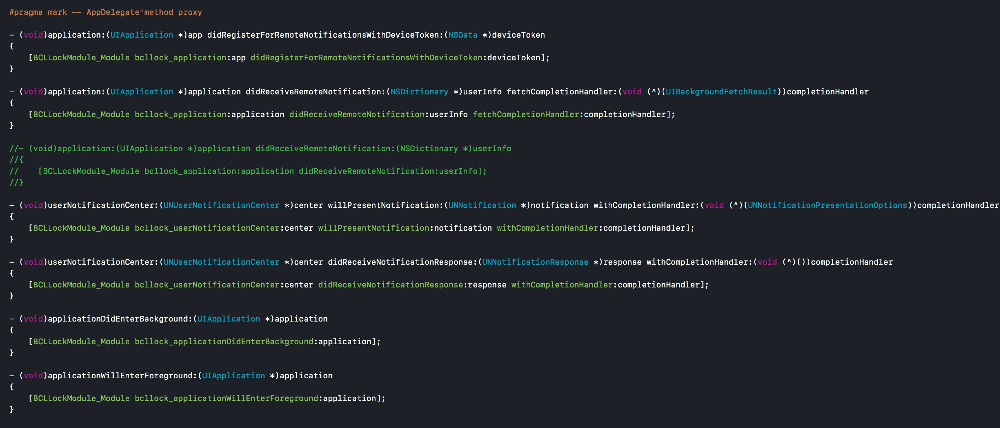
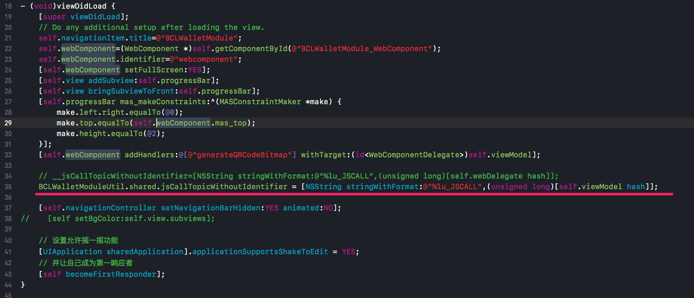

## proxy Appdelegate的方法

只需要创建一个EGProvider的分类，在此分类内重写Appdelegate的方法即可被proxy到



在这里我们为了EGProvider+BCLLockModule的干净、优雅，将方法的实现扔到了BCLLockModule_Module中。</br>
友盟的实现、接收到推送的实现均可在BCLLockModule_Module中理解。

## js-oc交互

### js invoke oc

``` objective-c
+ (JSCallNativeBlock)getLanguageTypeHandler:(EGViewModel *)viewmodel
{
    return ^(NSString *handler, id data, JSCallBack callback) {
        NSString *language = [[NSUserDefaults standardUserDefaults] objectForKey:@"bcl_lock_language"];
        callback(language);
    };
}
```
如getLanguageTypeHandler这个方法，是被js端调用，在oc原生这块我们需要遵守+ (JSCallNativeBlock)xxxxxHandler:(EGViewModel *)viewmodel的规则，xxxxx即为js端需调用的方法名称。

通过callback这个block将结果回调给js

### oc invoke js

在该项目中我们并未使用到需要oc调用js方法的场景，可以拿另外的项目举例



如图存下viewmodel的hash值，我这里使用的是用一个单例属性

``` objective-c
[self post:[BCLWalletModuleUtil shared].jsCallTopicWithoutIdentifier options:dict withResultBlock:nil];
```

需要调用时如上代码，</br>
[BCLWalletModuleUtil shared].jsCallTopicWithoutIdentifier: 存下的viewmodel hash值</br>
dict: 需传给js的参数，类型为id</br>
withResultBlock: 后接一个回调block(若需要接受js给过来的回调)
